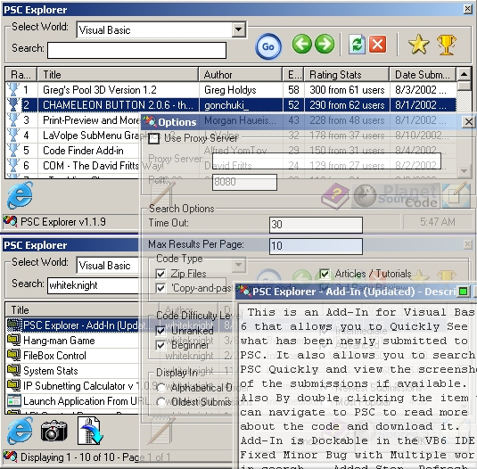



## PSC Explorer \- Add\-In \(v1\.1\.12\)

### Description

This is an Add-In for Visual Basic 6 that allows you to Quickly See what has been newly submitted to PSC. It also allows you to search PSC Quickly and view the screenshots of the submissions if available. Also By double clicking the item you can navigate to PSC to read more about the code and download it. Add-In is Dockable in the VB6 IDE. - Fixed Minor Bug with Multiple worlds in search. - Added Stop, Refresh Functions. View Multiple pages From your search now. Changed the UI a little bit. Commented more parts of the code. Please leave your comments so I can Make this Add-In Better. - *** Now you can also download the Zip files form PSC by just clicking a button.

----

New To Update (8/13/02)

----

1) View The Full Description of The Submission.

2) View Copy & Paste Code For easy access with VBIDE.

3) Quick Link to PSC - Launch PSC In your default browser so you can search and Vote for the Submissions.

----

NEW to v1.1.9

----

Now View the Top Code of the Month.

Fixed some minor bugs with the search.

Commented More of the Code.

***Still Allows you to***

1) View Screen Shots

2) Download Zip File

3) Visit PSC Page of the Submission

4) Search PSC - With the same search options that PSC has. (Level, Type, Sort, Number per Page.

5) Get Newest Submission

6) Connect using a proxy server.

7) Give you access to the largest Source code site on the internet... Where you need it, When you need it.
 
### More Info
 

             |
---                |---
**Submitted On**   |2002-08-18 19:48:26
**By**             |[whiteknight](https://github.com/Planet-Source-Code/PSCIndex/blob/master/ByAuthor/whiteknight.md)
**Level**          |Intermediate
**User Rating**    |4.9 (107 globes from 22 users)
**Compatibility**  |VB 6\.0
**Category**       |[Complete Applications](https://github.com/Planet-Source-Code/PSCIndex/blob/master/ByCategory/complete-applications__1-27.md)
**World**          |[Visual Basic](https://github.com/Planet-Source-Code/PSCIndex/blob/master/ByWorld/visual-basic.md)
**Archive File**   |[PSC\_Explor1209988222002\.zip](https://github.com/Planet-Source-Code/whiteknight-psc-explorer-add-in-v1-1-12__1-37848/archive/master.zip)

